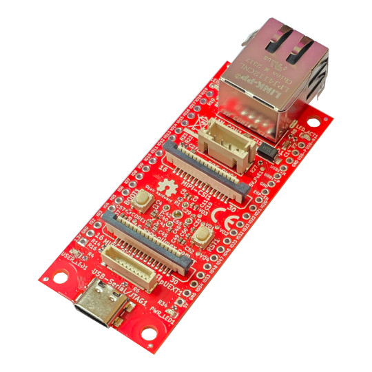

# ESP32-P4-DevKit
Development board for ESP32-P4 Dual core RISCV processor from Espressif

https://www.olimex.com/Products/IoT/ESP32-P4/ESP32-P4-DevKit/open-source-hardware

## MIPI-LCD2.8 demos

The ESP-IDF MIPI display demos under `SOFTWARE/Demo_Examples` support both Olimex MIPI-LCD2.8 revisions. They default to WLK2802MIPI-15P-V2. See the per-demo readmes for build instructions and [CHANGELOG.md](CHANGELOG.md) for this revision's configuration changes.

## Licensee
* Hardware is released under CERN Open Hardware Licence Version 2 - Strongly Reciprocal
* Software is released under GPL V3 Licensee
* Documentation is released under CC BY-SA 4.0
